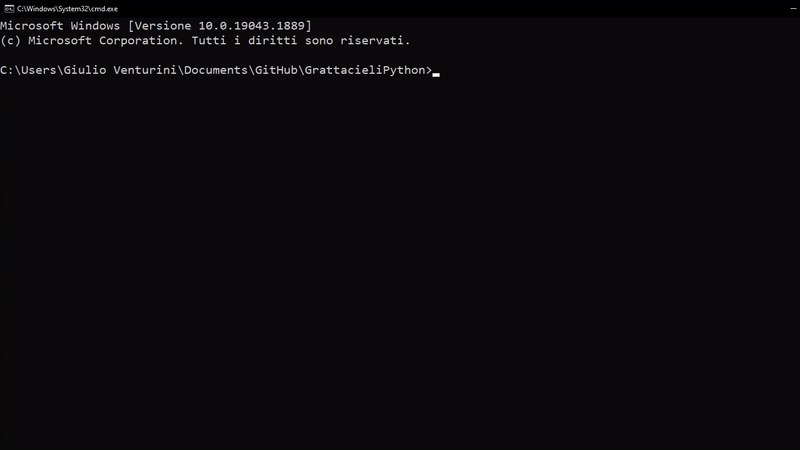

# <div align='center'> GrattacieliPython <div>





Play the logic puzzle 'Grattacieli' in your cli

## How to install & use

1. Clone the repository
```
git clone 
```

2. Change the directory to the new folder
```
cd GrattacieliPython
```

3. Start the program
```
python main.py
```

4. ***Play!!!***
